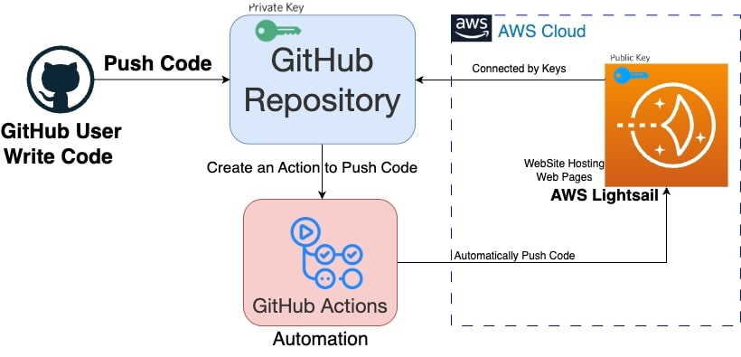

# Dr. Ahmad Raza Khan – Academic Portfolio Website

This repository hosts the source code for the personal academic website of **Dr. Ahmad Raza Khan**, showcasing his biography, research interests, publications, certifications, and contact information.

🌐 **Live Website**: [Visit Website](https://connectingahmad.info)  
👨‍🏫 **Profile Highlights**: AWS Certified Solutions Architect, CEH, CHFI, CTIA, AI Researcher, Cloud and Cybersecurity Expert

---

## 🔍 Features

- **Modern, Responsive Design** with animations and parallax sections.
- **Sections Included**:
  - Home with animated typewriter messages
  - Biography
  - Research Interests (Cloud Computing, Machine Learning, AI, Cybersecurity, Data Analysis)
  - Journal & Conference Publications
  - Books
  - Certifications with links
  - Services and Appointments
  - Contact Form with embedded iframe

- **Typewriter animation** dynamically displays professional titles and values.
- **Interactive modals** for detailed exploration of each research area and certifications.
- **Social Media Buttons**: LinkedIn, GitHub, Google Scholar, ResearchGate, Scopus, Web of Science, Coursera, TryHackMe, and more.

---

## 🧰 Built With

- **HTML5 / CSS3 / JavaScript**
- **Bootstrap 3.4**
- Font Awesome & Simple Line Icons
- Academicons for academic badges
- Google Analytics & Pace.js for preloading and performance

---
## 📦 CI/CD Pipeline Process Automation

The diagram below illustrates a CI/CD pipeline that automates the deployment of code from a GitHub repository to an AWS Lightsail instance using GitHub Actions.




### Workflow Description:

1. **Code Development**: A developer writes and tests code on their local machine.
2. **Push to GitHub**: The code is pushed to a remote GitHub repository, which serves as the central version-controlled storage.
3. **Trigger GitHub Actions**: Upon detecting a code push, GitHub Actions initiates a workflow. This workflow can include steps for building, testing, and deploying the application.
4. **Deployment to AWS Lightsail**: The workflow uses secure access credentials (represented by key icons) to deploy the application to an AWS Lightsail instance.

### Key Concepts:

- **GitHub Actions**: The CI/CD tool that automates the workflow.
- **AWS Lightsail**: The cloud service where the application is deployed.
- **Secure Authentication**: Keys are used to securely authenticate and authorize the deployment process.

This setup ensures a seamless and automated deployment process, enabling developers to focus on writing code while the pipeline handles the rest.

## 📁 File Structure

project-root/
│
├── index.html # Main HTML page
├── css/ # Stylesheets (Bootstrap, custom styles, animations)
├── js/ # JavaScript files (jQuery, animations, pace, modals)
├── images/ # Backgrounds and illustrations
├── Certifications/ # Certification PDF files
└── favicon.ico # Website favicon

yaml
Copy
Edit

---

## 🚀 Getting Started

1. Clone the repository:
   ```bash
   git clone https://github.com/yourusername/academic-portfolio.git
Open index.html in a web browser.

Customize content, links, and styles as needed.

✍️ Credits
Developed and maintained by Dr. Ahmad Raza Khan
Majmaah University, Kingdom of Saudi Arabia
Member of IEEE and ACM

📬 Contact
📧 Email: [ahmed@connectingahmad.info]
🔗 LinkedIn: linkedin.com/in/ahmad-raza-khan-68b39a225
🎓 Google Scholar: https://scholar.google.co.in/citations?hl=en&user=CD72xzgAAAAJ&view_op=list_works&sortby=pubdate

